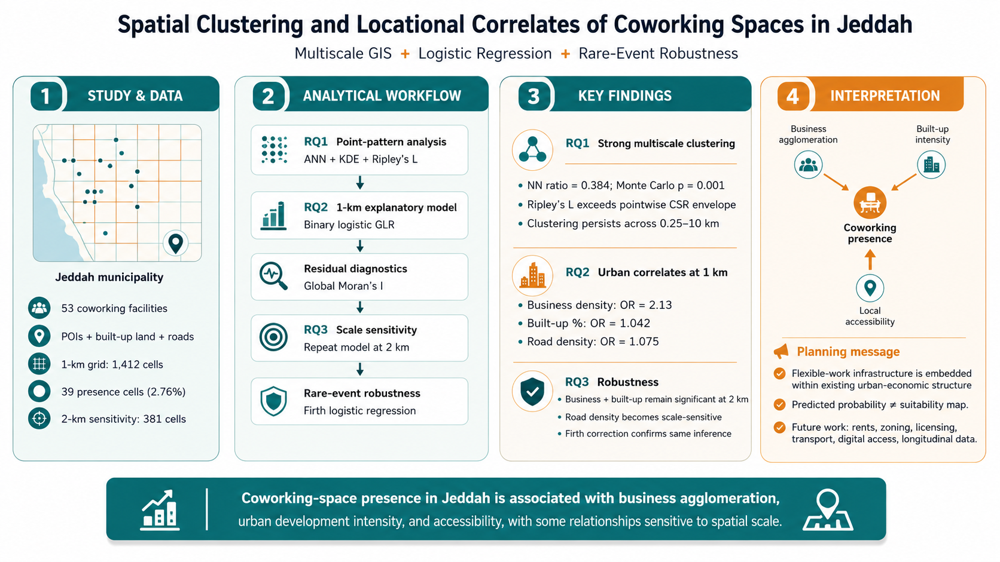

# Spatial Clustering and Locational Correlates of Coworking Spaces in Jeddah

A reproducible portfolio repository for a multiscale GIS and statistical analysis of coworking-space locations in Jeddah, Saudi Arabia.

> **Study scope:** 53 coworking facilities; point-pattern analysis; 1-km binary logistic regression; residual spatial diagnostics; 2-km scale sensitivity; and Firth bias-reduced logistic regression for rare-event robustness.



## Research questions

**RQ1.** Do coworking spaces in Jeddah exhibit statistically significant spatial clustering, and across what spatial scales does this concentration occur?

**RQ2.** Which characteristics of the urban environment are associated with the spatial presence of coworking spaces in Jeddah?

**RQ3.** Are the identified locational associations robust to changes in spatial aggregation scale?

## Analytical workflow

1. Spatial point-pattern analysis of 53 coworking locations.
2. Construction of a 1-km grid and urban explanatory variables.
3. Exploratory predictor screening.
4. Binary logistic generalized linear regression and residual diagnostics.
5. A 2-km spatial-scale sensitivity analysis.
6. Rare-event robustness analysis using Firth logistic regression.

## Main findings

- The observed nearest-neighbour ratio was **0.384** with a Monte Carlo clustering probability of **p = 0.001**.
- The observed centered Ripley's L-function exceeded the upper pointwise CSR envelope across **0.25-10 km**.
- In the primary 1-km model, coworking-space presence was positively associated with:
  - **Business density:** OR = 2.133
  - **Built-up percentage:** OR = 1.042
  - **Road density:** OR = 1.075
- At 2 km, business density and built-up percentage remained statistically significant, while road density became scale-sensitive.
- Firth bias reduction produced the same substantive inferential pattern.

## Repository structure

```text
.
├── README.md
├── LICENSE
├── CONTENT_LICENSE.md
├── CITATION.cff
├── requirements.txt
├── environment.yml
├── .gitignore
├── data/
│   ├── README.md
│   ├── processed_public/
│   ├── templates/
│   ├── raw/
│   └── private/
├── scripts/
├── figures/
├── tables/
├── docs/
└── outputs/
```

## Data availability and licensing

The repository intentionally **does not redistribute raw Google Maps / third-party POI records or ArcGIS geodatabases**. Some source data may be subject to third-party terms of use.

The public-data workflow is designed around derived analytical tables containing fields such as:

```text
grid_id
cw_presence
business_density
built_up_pct
road_density
```

Before adding any row-level dataset to `data/processed_public/`, confirm that redistribution is permitted.

See [`data/README.md`](data/README.md) and [`docs/data_dictionary.md`](docs/data_dictionary.md).

## Software

Core open-source workflow:

- Python 3.10+
- pandas
- numpy
- scipy
- statsmodels
- matplotlib
- geopandas
- shapely
- libpysal
- esda
- scikit-learn

The original project also used **ArcGIS Pro / ArcPy** for several GIS processing steps. ArcPy is not installable through ordinary `pip`; it is supplied with ArcGIS Pro.

## Quick start

Clone the repository:

```bash
git clone https://github.com/123dere/jeddah-coworking-spatial-analysis.git
cd jeddah-coworking-spatial-analysis
```

Create an environment:

```bash
conda env create -f environment.yml
conda activate jeddah-coworking
```

Or install the Python dependencies:

```bash
pip install -r requirements.txt
```

Validate a public analytical table:

```bash
python scripts/01_validate_inputs.py data/processed_public/jeddah_grid_1km_public.csv
```

Run the non-spatial statistical workflow:

```bash
python scripts/02_exploratory_screening.py data/processed_public/jeddah_grid_1km_public.csv
python scripts/03_logistic_glr.py data/processed_public/jeddah_grid_1km_public.csv
python scripts/06_firth_logistic.py data/processed_public/jeddah_grid_1km_public.csv
```

## Reproducibility note

The scripts use **relative paths and command-line inputs**, not local Windows paths. This makes the public repository portable across computers.

The exact publication analysis should be reproduced only from shareable, verified analytical inputs. Where third-party licensing prevents redistribution, this repository documents the processing workflow and publishes result tables instead.

## Figures

The repository contains selected publication/portfolio figures in `figures/`. Verify any underlying basemap or third-party imagery license before redistributing map products.

## Citation

If you use this repository, please cite it using the metadata in [`CITATION.cff`](CITATION.cff).

After publication, update the repository with:

- the journal DOI;
- a GitHub Release;
- a Zenodo archive DOI;
- the final citation.

## Authors

- Apri Zulmi Hardi
- Alok Tiwari
- Ammar A. Naji

Department of Urban and Regional Planning, King Abdulaziz University, Jeddah, Saudi Arabia.

## License

Code is released under the **MIT License** unless otherwise stated.

Original figures and documentation created by the authors may be shared under **CC BY 4.0** as described in [`CONTENT_LICENSE.md`](CONTENT_LICENSE.md). Third-party data retain their original licenses.
